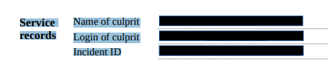

# Blacked-out PDF (1 point)

Hi, CSIRT trainee,

verify that the HR department sufficiently blacks-out personal information in
published documents - for example, you can use an official apology form for a
security incident.

* [Download the form](censored_pdf.zip) (sha256 checksum:
  `571490da49d1e72ff64b39c931bca07d43e4cd42a59d30c3d52e625712266119`)

See you in the next incident!

## Hints

* Be aware that not all documents are blacked-out correctly.

## Solution

The document is "censored" only by placing black rectangles over sensitive
information. However, the underlying text is still in the document, so it's
enough to use "text selection" tool in the selected PDF viewer and copy-paste
the content.



Pasting the clipboard to text editor reveals the flag

```
Service records
Name of culprit Patience Phillips
Login of culprit catwomen@cypherfix.tcc
Incident ID FLAG{uBlQ-wB81-0Bhr-2ylo}
```
