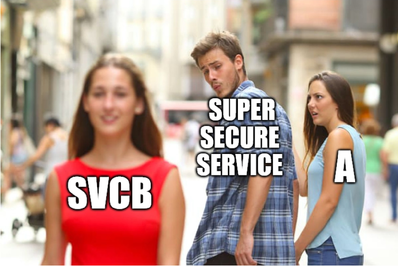

# Old service (2 points)

Hi, TCC-CSIRT analyst,

rumors are spreading in the ticketing system that an old, unmaintained service
is running somewhere in the network, which could be a security risk (even
though it's called `3S - Super Secure Service`). Old-timers claim that it had
the domain name `supersecureservice.cypherfix.tcc`. This name does not exist in
the current DNS, but some information might still be available on the DNS
server `ns6-old.tcc`, which will be shut down soon.

Explore the service and gather as much information as possible about 3S.

See you in the next incident!

## Hints

* Any resource records can be useful.

## Solution

Since we know the name of the old DNS server we can ask it to resolve
`supersecureservice.cypherfix.tcc`.

```console
$ dig @ns6-old.tcc supersecureservice.cypherfix.tcc

; <<>> DiG 9.20.2-1-Debian <<>> @ns6-old.tcc supersecureservice.cypherfix.tcc
; (2 servers found)
;; global options: +cmd
;; Got answer:
;; ->>HEADER<<- opcode: QUERY, status: NOERROR, id: 5369
;; flags: qr aa rd; QUERY: 1, ANSWER: 1, AUTHORITY: 0, ADDITIONAL: 1
;; WARNING: recursion requested but not available

;; OPT PSEUDOSECTION:
; EDNS: version: 0, flags:; udp: 1232
; COOKIE: 333b0cac0efd800c010000006703c79a0a4cba71716f769e (good)
;; QUESTION SECTION:
;supersecureservice.cypherfix.tcc. IN   A

;; ANSWER SECTION:
supersecureservice.cypherfix.tcc. 86400 IN A    10.99.24.21

;; Query time: 10 msec
;; SERVER: 10.99.24.20#53(ns6-old.tcc) (UDP)
;; WHEN: Mon Oct 07 13:35:54 CEST 2024
;; MSG SIZE  rcvd: 105
```

We retrieved A-record indicating the service the IP address is `10.99.24.21`.
Let's scan it to see what is running there.

```console
$ nmap -p - 10.99.24.21
Starting Nmap 7.94SVN ( https://nmap.org ) at 2024-10-07 13:36 CEST
Nmap scan report for 10.99.24.21
Host is up (0.011s latency).
Not shown: 65534 closed tcp ports (reset)
PORT     STATE SERVICE
8020/tcp open  intu-ec-svcdisc
```

If we try to open this page in a browser, we'll see a message informing us that
we should acquire/use the correct hostname.


Let's try to send the request using the `Host` header.

```console
$ curl -H "Host: supersecureservice.cypherfix.tcc"  10.99.24.21:8020
<!DOCTYPE html>
<html>
<head>
    <title>TCC Super Service is not here!</title>
    <style>
        .centered {
            text-align: center;
        }
    </style>
</head>
<body>
    <div class="centered">
        
    </div>
</body>
```

We're getting closer, but still not there.


As the image indicates (and as a hint tried to suggest from the very beginning)
we need to query all resource records, not just the main ones.

```console
$ dig @ns6-old.tcc supersecureservice.cypherfix.tcc ANY

; <<>> DiG 9.20.2-1-Debian <<>> @ns6-old.tcc supersecureservice.cypherfix.tcc ANY
; (2 servers found)
;; global options: +cmd
;; Got answer:
;; ->>HEADER<<- opcode: QUERY, status: NOERROR, id: 8122
;; flags: qr aa rd; QUERY: 1, ANSWER: 7, AUTHORITY: 0, ADDITIONAL: 1
;; WARNING: recursion requested but not available

;; OPT PSEUDOSECTION:
; EDNS: version: 0, flags:; udp: 1232
; COOKIE: 40403d5750a6fe6f010000006703c9420441fad4916e5d86 (good)
;; QUESTION SECTION:
;supersecureservice.cypherfix.tcc. IN   ANY

;; ANSWER SECTION:
supersecureservice.cypherfix.tcc. 86400 IN TXT  "Super secure service in testing mode, any records are hipsters friendly!"
supersecureservice.cypherfix.tcc. 86400 IN HINFO "TCC 686" "TCC-OS 20.20"
supersecureservice.cypherfix.tcc. 86400 IN SVCB 1 web3s-746865636174636832303234.cypherfix.tcc. alpn="h2,h3,mandatory=alpn" port=8020
supersecureservice.cypherfix.tcc. 86400 IN SVCB 4 web3s-7468656361746368323032343.cypherfix.tcc. alpn="h2,h3,mandatory=alpn" port=8020
supersecureservice.cypherfix.tcc. 86400 IN SVCB 2 web3s-7468656361746368323032342.cypherfix.tcc. alpn="h2,h3,mandatory=alpn" port=8020
supersecureservice.cypherfix.tcc. 86400 IN A    10.99.24.21
supersecureservice.cypherfix.tcc. 86400 IN AAAA 2001:db8:7cc::24:21

;; Query time: 10 msec
;; SERVER: 10.99.24.20#53(ns6-old.tcc) (TCP)
;; WHEN: Mon Oct 07 13:42:59 CEST 2024
;; MSG SIZE  rcvd: 526
```

This time we can see that the response contains also service binding (SVCB)
records. If we use the one with lowest priority as our `Host` header instead,
the FLAG is revealed.

```console
$ curl -H "Host: web3s-746865636174636832303234.cypherfix.tcc"  10.99.24.21:8020
<!DOCTYPE html>
<html>
<head>
    <title>Welcome to superservice</title>
    <style>
        .centered {
            text-align: center;
        }
    </style>
</head>
<body>
    <div class="centered">
    <form action="/login" method="post">
        <label for="username">Username:</label>
        <input type="text" id="username" name="username" required>
        <br>
        <label for="password">Password:</label>
        <input type="password" id="password" name="password" required>
        <br>
        <button type="submit">Submit</button>
    </form><br>

    <br>
    <small>
    You have right to choose password easy to remember and hard to guess.<br>
    Your security is important for us, do not hesitate to ask for more security.<br>
    Log in gracefully and purring like a dozen of cats, so no one can you see you.<br>
    If you fail to login, use your personal identifier FLAG{yNx6-tH9y-hKtB-20k6} and show it to user support.<br>
    Entering a wrong name or password more than seven times is strictly prohibited!<br>
    </small>
    </div>
</body>
</html>
```


