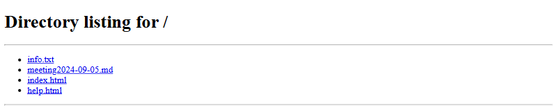

# Personal portal (1 point)

Hi, CSIRT trainee,

check if there is a leak of non-public data on the personal portal.

* The portal is accesible at http://perso.cypherfix.tcc.

See you in the next incident!

## Hints

* Don't waste time trying to log in.
* Base64 is most popular encoding.

## Solution

When we open the portal and follow the `Help` link we can see a directory
listing on the server.



Trying to access the documents directly by clicking the links returns
`404 Not Found`, however, we can notice that the URL of the help page is
`http://perso.cypherfix.tcc/files?file=help.html`. Since `help.html` is one of
the files we can see in the listing, we can deduce that the script displays a
file from this directory based on provided argument.

By replacing the parameter value we can retrieve the other files in the
directory. `meeting2024-09-05.md` contains a familiar signature string which
yields a flag when decoded.

```
$ curl http://perso.cypherfix.tcc/files?file=meeting2024-09-05.md
# Meeting Minutes: Deployment of Personnel Portal

* Date: September 5, 2024
* Time: 10:00 AM - 11:30 AM
* Location: Conference Room 3 / Zoom
* Attendees:
    * John Smith (Project Manager)
    * Sarah Lee (HR Director)
    * Mark Johnson (IT Lead)
    * Emily Davis (Operations Manager)
    * Michael Brown (Marketing Lead)
* Agenda:
    * Review of Personnel Portal Features
    * Deployment Timeline
    * Roles and Responsibilities
    * Communication Plan
    * Risk Assessment and Mitigation
    * Next Steps

## 1. Review of Personnel Portal Features

* John Smith provided an overview of the portal’s key features, including personal information management, payroll access, time-off requests, and performance review tracking.
* Sarah Lee emphasized the importance of the self-service functionality, which will reduce the HR team's workload.
* Mark Johnson confirmed the technical readiness of the portal, noting successful tests of integration with existing HR systems.

## 2. Deployment Timeline

* Proposed launch date: October 1, 2024.
* A two-week testing phase is planned from September 15-29, where select employees will have access to ensure smooth operations.
* Final adjustments and bug fixes to be completed by September 30.

## 3. Roles and Responsibilities

* John Smith will oversee the deployment process.
* Sarah Lee will handle internal training for the HR department and end users.
* Mark Johnson will manage the technical aspects, including server setup and maintenance.
* Michael Brown will coordinate with the marketing team for internal communications about the launch.

## 4. Communication Plan

* Michael Brown proposed a multi-channel communication strategy, including:
    * Internal email announcements to employees.
    * Training sessions for HR and department heads.
    * A FAQ section within the portal and on the company intranet.
* Sarah Lee suggested scheduling a webinar for a full system walkthrough for employees.

## 5. Risk Assessment and Mitigation

* Potential Risks Identified:
    * Technical issues or system outages during launch.
    * Lack of employee engagement or understanding of the portal features.
    * Data security concerns.
* Mitigation Strategies:
    * Mark Johnson will monitor the system closely post-launch and have a support team on standby.
    * John Smith will ensure training materials are accessible and user-friendly.
    * Sarah Lee will conduct a survey post-launch to gather feedback and address concerns.

## 6. Next Steps

* Mark Johnson to finalize the technical setup and conduct security testing by September 10.
* Sarah Lee to begin scheduling training sessions with department heads by September 12.
* John Smith to prepare a detailed launch plan and circulate it to the team by September 8.
* Michael Brown will draft the email announcements and share them with the team for review by September 14.


Meeting adjourned at: 11:30 AM

Next meeting: September 12, 2024, 2:00 PM

Signature code:

RkxBR3tZemZOLVo5UlAtb2MxUC1hdURvfQo=

$ echo RkxBR3tZemZOLVo5UlAtb2MxUC1hdURvfQo= | base64 -d
FLAG{YzfN-Z9RP-oc1P-auDo}
```
