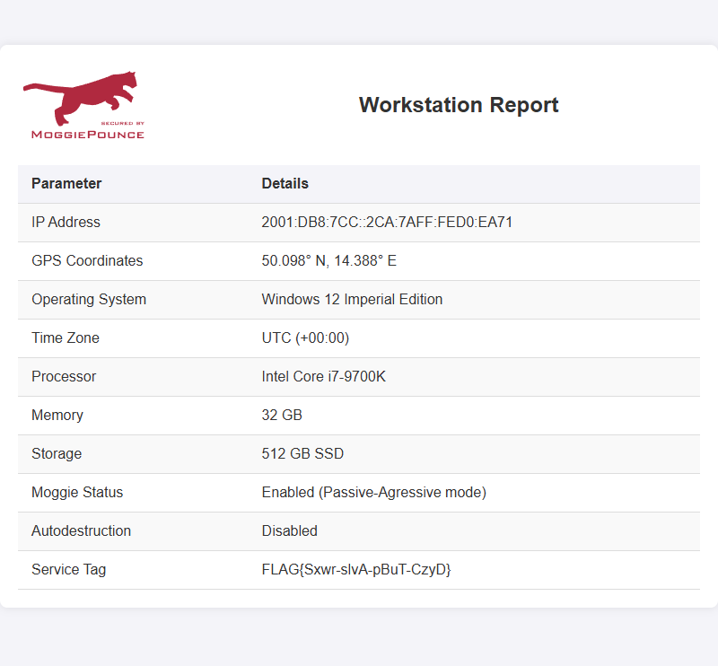

# Request of cooperation (1 point)

Hi, CSIRT trainee,

we have received a request for cooperation issued by law enforcement
authorities to locate a device on our network `2001:db8:7cc::/64`. Please try
to accommodate the requester as much as possible.

* [Download the request of cooperation](request_of_cooperation20_2024_TCC.zip)
  (sha256 checksum: `67bd096145a74feb4f1ffad849721547ac4c29de52f525282a5e01a978109878`)

See you in the next incident!

## Hints

* Find out if there is a way to create an IPv6 address from a MAC address.

## Solution

The document extracted from downloaded archive explains how the address of the
device should be found. It mentions that the device uses stateless
autoconfiguration to connect to the IPv6 networks.

I also provides some details about the device, i.e.
* Network Range: `2001:db8:7cc::/64`
* Device media access control address: `00ca.7ad0.ea71`
* Device provides a webpage with statistical and localization data on port
  `1701/TCP`.

We can use the autoconfiguration algorithm to calculate the resulting IP
address of the device, i.e.

* Take the MAC of the network device (`00:ca:7a:d0:ea:71`)
* Flip bit 2 of the first byte (`02:ca:7a:d0:ea:71`)
* Insert `ff:fe` in the middle (`02:ca:7a:ff:fe:d0:ea:71`)
* Combine with the network prefix into an IPv6 address (`2001:db8:7cc::02ca:7aff:fed0:ea71`)

Once we calculated the address, we can open the webpage on port `1701` to
retrieve the flag listed in the `Service Tag` section.

