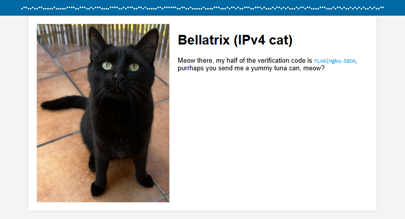
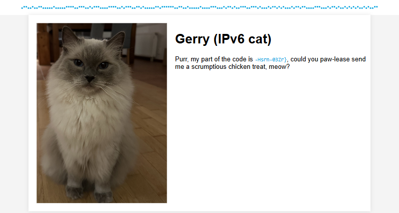

# VPN Access (1 point)

Hi, CSIRT trainee,

nobody can work secure from home without [VPN]. You have to install and
configure OpenVPN properly. Configuration file can be downloaded from CTFd's
link VPN. Your task is to activate VPN, visit the testing pages, and get your
code proving your IPv4 and IPv6 readiness.

* IPv4 testing page is available at http://bellatrix.cypherfix.tcc.
* IPv6 testing page is available at http://gerry.cypherfix.tcc.

See you in the next incident!

## Hints

* https://openvpn.net/community-resources/reference-manual-for-openvpn-2-4/
* Do not run more different VPNs at once.

## Solution

It is necessary to download OpenVPN configuration file from the provided
address and then start OpenVPN with the provided configuration file.

After connecting to VPN the testing pages become available and each reveal one
half of the flag.

[VPN]: https://www.thecatch.cz/vpn
