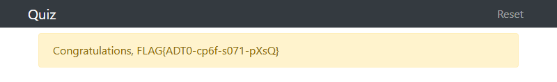

# Who is who? (1 point)

Hi, TCC-CSIRT analyst,

we have found that many analysts are unclear about basic terms. Verify your
understanding by taking the quiz on the http://csirt-quiz.e-learning.tcc.

See you in the next incident!

## Solution

We need to pass a quiz for the website to reveal a flag. The correct answers are:

* Czech CSIRT team with status certified by Trusted Introducer.
  * ALEF-CSIRT
* Database of European CSIRT teams.
  * Trusted Introducer
* Czech CSIRT team celebrating 20th anniversary.
  * CESNET-CERTS
* The first official CSIRT team in the Czech Republic.
  * CESNET-CERTS
* National CSIRT of the Czech Republic.
  * CSIRT.CZ
* The European Union Agency for Cybersecurity.
  * ENISA
* Government CERT of the Czech Republic.
  * GovCERT.CZ
* International organization of CSIRT teams.
  * FIRST
* CSIRT team for the EU institutions and agencies.
  * CERT-EU
* Community of European CSIRT teams.
  * TF-CSIRT

Once all 10 correct answers are provided, the flag is displayed.

